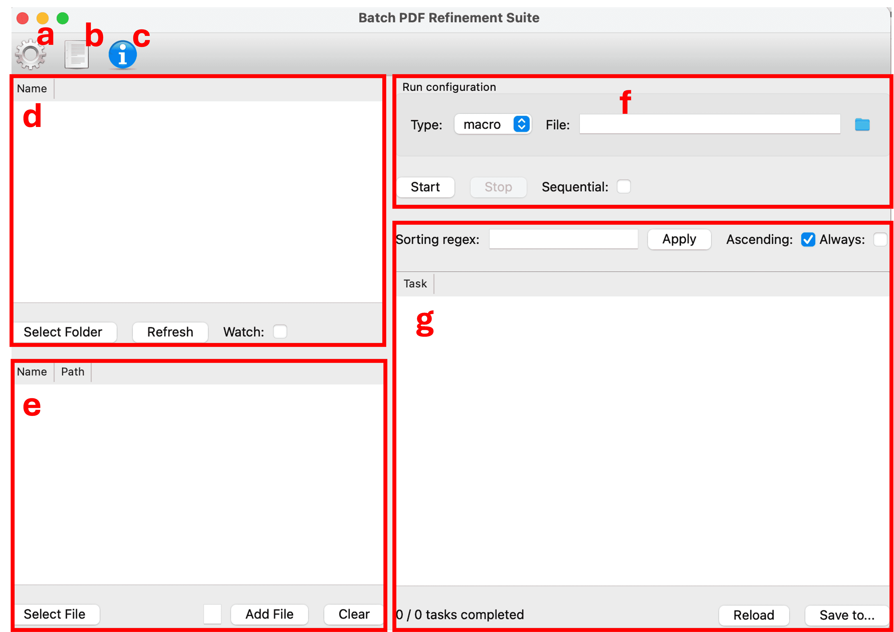
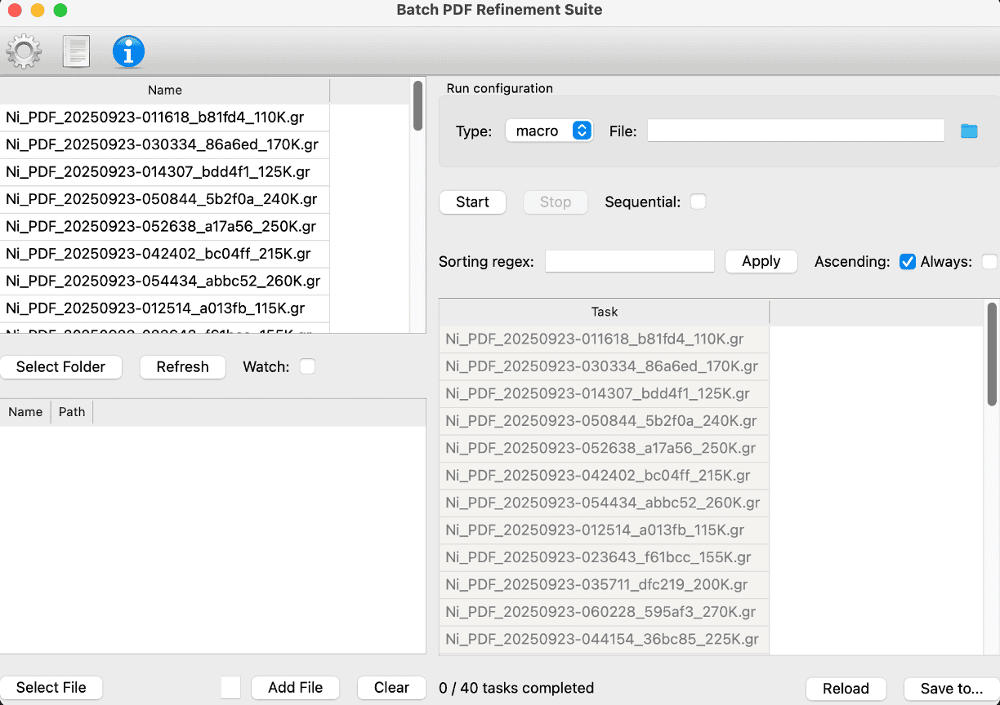
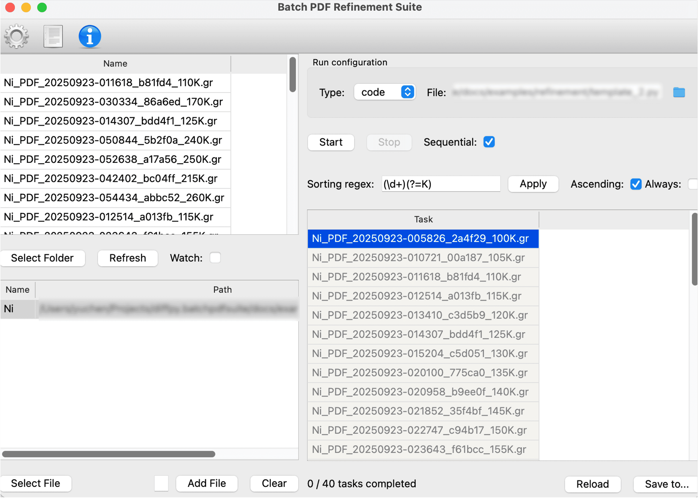

:tocdepth: -1

.. index:: getting-started

.. _getting-started:

================
Getting started
================

``diffpy.batchpdfsuite`` is a GUI for batch refinements of multiple PDF
datasets. It is built on top of the
`diffpy.srfit <https://github.com/diffpy/diffpy.srfit>`_ and
`diffpy.apps <https://github.com/diffpy/diffpy.apps>`_ libraries.

This tutorial will guide you through the interface and usage of ``diffpy.batchpdfsuite``.
For installation, please refer to the `README <https://github.com/diffpy/diffpy.batchpdfsuite#installation>`_

``diffpy.batchpdfsuite`` Interface
----------------------------------

Here is the main interface of ``diffpy.batchpdfsuite``.

- *a* - **Settings**: To be implemented in the future for user settings.
- *b* - **Log**: The panel containing the runtime output during the refinement process.
- *c* - **Help**: To be implemented in the future for help and documentation.
- *d* - **Experiment Data Panel**: The panel to load and display the loaded experiment data profile.
- *e* - **Structure Data Panel**: The panel to load and display the structure file to be used for refinement.
- *f* - **Control Panel**: The panel to control the refinement process.
- *g* - **Task Panel**: The panel to view the status of the refinement tasks. Each task is created automatically when the corresponding experiment data is loaded.

A Walkthrough Example
----------------------

Download the example data from  :download:`here <../examples/example.zip>`

1. Unzip the downloaded file.
2. Launch the ``diffpy.batchpdfsuite`` GUI.

.. code-block:: bash

    bpdfsuite

3. Load the experiment data by clicking **Select Folder** in the **Experiment Data Panel** and choosing the ``data`` folder in the unzipped example data.

Besides the experiment data profile, the refinement tasks will also be generated automatically.

.. note::

    The **Watch** option allows ``diffpy.batchpdfsuite`` to monitor the
    selected folder in real time and create new refinement tasks automatically
    when new experiment data is added to the folder. For simplicity, we will
    not use this option in this tutorial.

4. Load the structure file by clicking **Select File** in the **Structure Data Panel** and choosing ``refinement/Ni.cif``

To load the structure file, you need to set the name for the structure file to be
referenced in the refinement process and then click **Add File**. You can also
accepts the default name and click **Add File** directly.

5. Load the refinement settings. You can either
    - Set **Type** to be ``Code`` and load the file ``refinement/template_2.py``. Or
    - Set **Type** to be ``Macro`` and load the file ``refinement/single-phase.dp-in``

.. note::

    To learn how to write the Python script for ``diffpy.batchpdfsuite``, please
    find the available parameters during the refinement process in the ``refinement/template_2.py``
    file, and write the script according to your needs.

    To learn how to write the Diffpy macro file for ``diffpy.batchpdfsuite``, please
    refer to the ``diffpy.apps``
    `documentation <https://www.diffpy.org/diffpy.apps/getting-started.html#how-to-write-macro>`_

5. Check the ``Sequential`` option in the **Control Panel**.

.. note::

    The ``Sequential`` option allows the parameters in the following tasks to take
    their previous task's refined values as their initial values.

6. Set the sorting regex to be ``(\d+)(?=K)`` and click **Apply** in the **Task Panel**.

Sequential refinement requires the tasks to be sorted in a specific order, i.e. for
temperature-dependent refinement, the tasks should be sorted in ascending/descending order of temperature.

.. note::

    The sorting regex ``(\d+)(?=K)`` is used to extract the temperature value
    from the experiment data file name. ``\d`` means any numeric digit,
    and ``+`` means the previous character, ``\d`` in this case, should be repeated one or more times.
    The ``(?=K)`` ensures that the previous matched group, ``(\d+)`` in this case,
    must be followed by the character ``K``.

    To learn more about regex, please refer to the `Python regex documentation <https://docs.python.org/3/library/re.html>`_

7. Select the tasks you want to begin the process and click **Start** in the **Control Panel**.

8. Click the **Log** Icon to view the runtime output during the refinement process.

9. Double click the finished tasks in the **Task Panel** to view the refined results.

10. (Optional) Click **Save to** in the **Task Panel** to save the result in another place. By default, they are
stored in ``fit_results`` under the experiment data folder.
